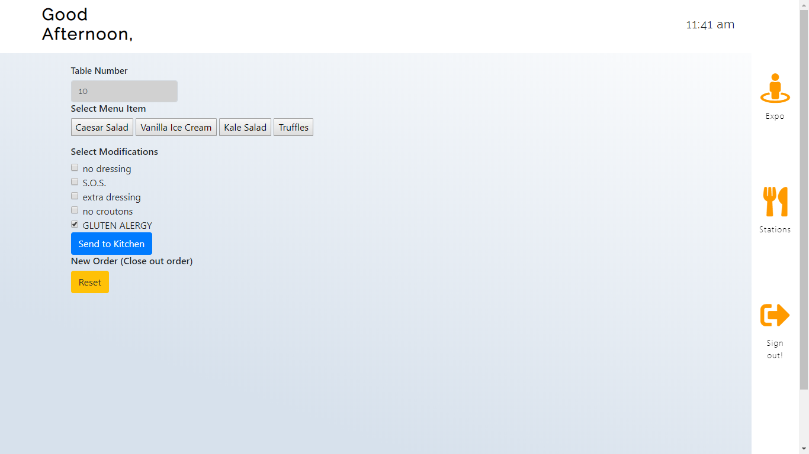
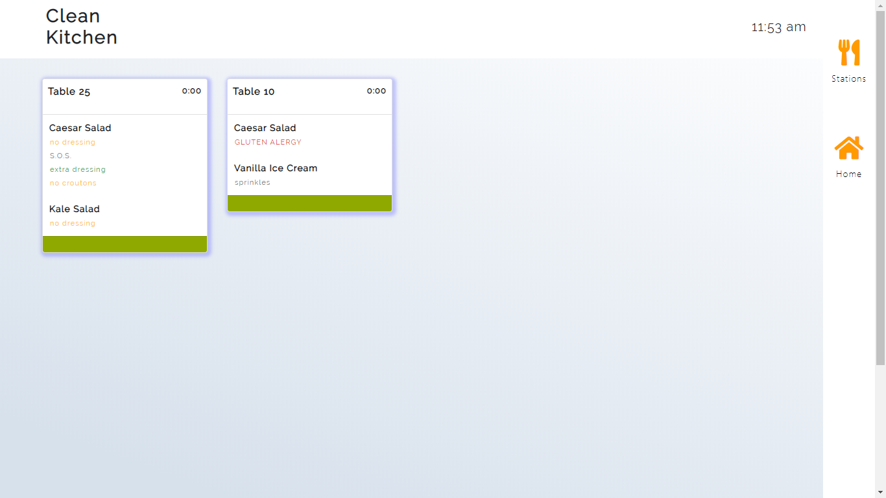
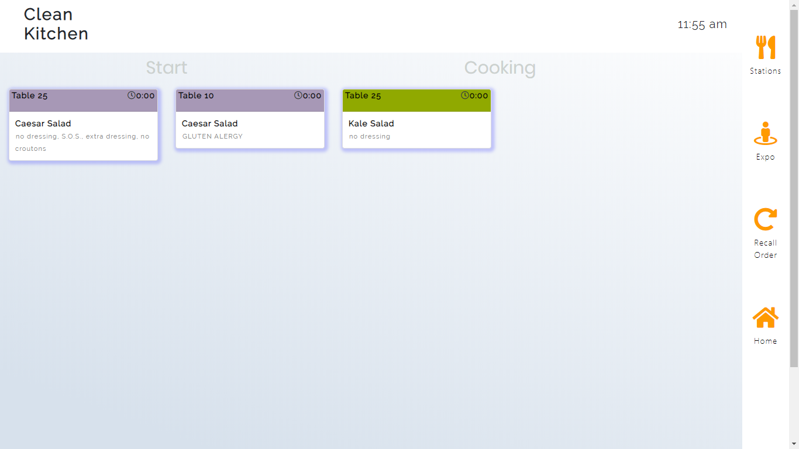
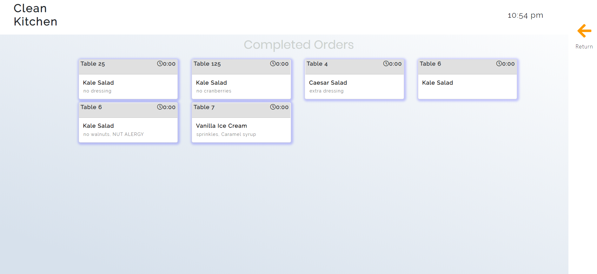

# Clean Kitchen Pos System 

## Description

PoS systems are used in kitchens to track food orders and their progress.  However, these systems could use an upgrade within their design.

Our project is a readible, user-friendly PoS System for kitchens.  Currently set up for the back of the house.

## Technologies used 
Express.Js  
Postman  
Handlebar.js  
Jquery  
Sequelize

## Screenshots

  
  
  
  

## Link 
Check it out!

https://hidden-lowlands-14981.herokuapp.com/

## Contributors

Brian Graf (https://github.com/astrobeef/)

Richard Klevan (https://github.com/raklevan)

Cibelle Montor (https://github.com/cibellem)

Donovan Youkhana (https://github.com/Dyoukhana)